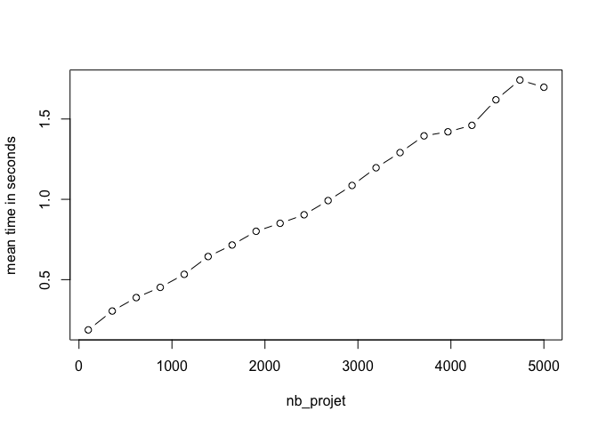

# Projet d’Algorithmique

### Dorian Manouvriez

### Matthieu Gosset

### Clément Bernard

#### M2DS SAF

### 19 janvier 2020

Le `projet-algo` R package est un package créé dans le cadre du projet
d’algorithmique du M2 Data Science SAF de l’Université Paris-Saclay.
Il implémente **trois solutions** qui permettent d’**attribuer des
équipes d’élèves à des projets** qui ont une certaine capacité selon
l’ordre de préférence des élèves.

Pour l’installer :

``` r
devtools::install_github("mattgos/projet-algo")
```

    ## Skipping install of 'projet' from a github remote, the SHA1 (cebe9130) has not changed since last install.
    ##   Use `force = TRUE` to force installation

``` r
library(projet)
```

## Nombre d’élèves et de projets fixés

On fixe `nb_eleve=100`et `nb_proj=5`.

Générons les données :

``` r
S=simu(nb_eleve = 100, nb_proj = 5)
S
```

    ## $P
    ## [1] 20 20 20 20 20
    ## 
    ## $G
    ## $G[[1]]
    ##  [1] 48 56 50 39 71 32 89 28 45 81 98 53 10  4 21 33 86
    ## 
    ## $G[[2]]
    ##  [1]  42  87  59  68  83  22  34  88  66  91  23 100  99  26
    ## 
    ## $G[[3]]
    ##  [1] 35 25 94 44 67 62 93 85 12 64 82 78  8
    ## 
    ## $G[[4]]
    ##  [1] 63 55 19 76 90 70 96 11 80  1 73 43
    ## 
    ## $G[[5]]
    ## [1] 17  3 37 51 77 58 95 27 31
    ## 
    ## $G[[6]]
    ## [1] 69 38 54 97  5 16  7 57
    ## 
    ## $G[[7]]
    ## [1] 18 40 60 13 79
    ## 
    ## $G[[8]]
    ## [1] 20 15 74 49  2
    ## 
    ## $G[[9]]
    ## [1]  6 36 29 65 14
    ## 
    ## $G[[10]]
    ## [1]  9 92 84
    ## 
    ## $G[[11]]
    ## [1] 24 41
    ## 
    ## $G[[12]]
    ## [1] 61
    ## 
    ## $G[[13]]
    ## [1] 47
    ## 
    ## $G[[14]]
    ## [1] 52
    ## 
    ## $G[[15]]
    ## [1] 75
    ## 
    ## $G[[16]]
    ## [1] 46
    ## 
    ## $G[[17]]
    ## [1] 72
    ## 
    ## $G[[18]]
    ## [1] 30
    ## 
    ## 
    ## $R
    ##       [,1] [,2] [,3] [,4] [,5]
    ##  [1,]    3    5    2    4    1
    ##  [2,]    2    5    3    4    1
    ##  [3,]    4    3    1    5    2
    ##  [4,]    2    4    5    1    3
    ##  [5,]    3    4    2    1    5
    ##  [6,]    2    5    1    4    3
    ##  [7,]    3    4    1    5    2
    ##  [8,]    3    4    1    2    5
    ##  [9,]    4    2    5    3    1
    ## [10,]    2    1    4    5    3
    ## [11,]    1    2    3    5    4
    ## [12,]    5    2    4    1    3
    ## [13,]    5    1    4    2    3
    ## [14,]    1    3    5    4    2
    ## [15,]    3    4    2    5    1
    ## [16,]    5    4    3    1    2
    ## [17,]    1    4    3    5    2
    ## [18,]    1    2    5    3    4

Nous avons implémenté 6 alogrithmes : - `glouton_algorithm` -
`glouton_rcpp` - `enumeration` - `enumeration_rcpp` - `branch_and_bound`
- `branch_and_bound_rcpp`

Ils prennent tous en arguments le contenu du retour de la fonction simu
: - `P`: la liste des capacités maximales des projets - `G`: la liste
des groupes et des élèves qui les constituent - `R`: une matrice qui
contient l’ordre de préférence de chaque groupe

Les fonctions retournent toujours une matrice qui contient la liste de
tous les élèves, leur numéro de groupe ainsi que le projet auxquels ils
sont affectés.

``` r
glouton_algorithm(S$G,S$P,S$R)
```

    ##        Eleve Groupe Projet
    ##   [1,]     1      4      5
    ##   [2,]     2      8      1
    ##   [3,]     3      5      1
    ##   [4,]     4      1      3
    ##   [5,]     5      6      5
    ##   [6,]     6      9      2
    ##   [7,]     7      6      5
    ##   [8,]     8      3      4
    ##   [9,]     9     10      1
    ##  [10,]    10      1      3
    ##  [11,]    11      4      5
    ##  [12,]    12      3      4
    ##  [13,]    13      7      4
    ##  [14,]    14      9      2
    ##  [15,]    15      8      1
    ##  [16,]    16      6      5
    ##  [17,]    17      5      1
    ##  [18,]    18      7      4
    ##  [19,]    19      4      5
    ##  [20,]    20      8      1
    ##  [21,]    21      1      3
    ##  [22,]    22      2      2
    ##  [23,]    23      2      2
    ##  [24,]    24     11      1
    ##  [25,]    25      3      4
    ##  [26,]    26      2      2
    ##  [27,]    27      5      1
    ##  [28,]    28      1      3
    ##  [29,]    29      9      2
    ##  [30,]    30     18      3
    ##  [31,]    31      5      1
    ##  [32,]    32      1      3
    ##  [33,]    33      1      3
    ##  [34,]    34      2      2
    ##  [35,]    35      3      4
    ##  [36,]    36      9      2
    ##  [37,]    37      5      1
    ##  [38,]    38      6      5
    ##  [39,]    39      1      3
    ##  [40,]    40      7      4
    ##  [41,]    41     11      1
    ##  [42,]    42      2      2
    ##  [43,]    43      4      5
    ##  [44,]    44      3      4
    ##  [45,]    45      1      3
    ##  [46,]    46     16      4
    ##  [47,]    47     13      1
    ##  [48,]    48      1      3
    ##  [49,]    49      8      1
    ##  [50,]    50      1      3
    ##  [51,]    51      5      1
    ##  [52,]    52     14      3
    ##  [53,]    53      1      3
    ##  [54,]    54      6      5
    ##  [55,]    55      4      5
    ##  [56,]    56      1      3
    ##  [57,]    57      6      5
    ##  [58,]    58      5      1
    ##  [59,]    59      2      2
    ##  [60,]    60      7      4
    ##  [61,]    61     12      2
    ##  [62,]    62      3      4
    ##  [63,]    63      4      5
    ##  [64,]    64      3      4
    ##  [65,]    65      9      2
    ##  [66,]    66      2      2
    ##  [67,]    67      3      4
    ##  [68,]    68      2      2
    ##  [69,]    69      6      5
    ##  [70,]    70      4      5
    ##  [71,]    71      1      3
    ##  [72,]    72     17      4
    ##  [73,]    73      4      5
    ##  [74,]    74      8      1
    ##  [75,]    75     15      3
    ##  [76,]    76      4      5
    ##  [77,]    77      5      1
    ##  [78,]    78      3      4
    ##  [79,]    79      7      4
    ##  [80,]    80      4      5
    ##  [81,]    81      1      3
    ##  [82,]    82      3      4
    ##  [83,]    83      2      2
    ##  [84,]    84     10      1
    ##  [85,]    85      3      4
    ##  [86,]    86      1      3
    ##  [87,]    87      2      2
    ##  [88,]    88      2      2
    ##  [89,]    89      1      3
    ##  [90,]    90      4      5
    ##  [91,]    91      2      2
    ##  [92,]    92     10      1
    ##  [93,]    93      3      4
    ##  [94,]    94      3      4
    ##  [95,]    95      5      1
    ##  [96,]    96      4      5
    ##  [97,]    97      6      5
    ##  [98,]    98      1      3
    ##  [99,]    99      2      2
    ## [100,]   100      2      2

``` r
one.simu <- function(nb_eleve,nb_projet,max_eleve=NULL, func = "glouton")
{
  S=simu(nb_eleve,nb_projet,max_eleve)
  if(func == "glouton"){t <- system.time(glouton_algorithm(S$G,S$P,S$R))[[1]]}
  if(func == "glouton_rcpp"){t <- system.time(glouton_rcpp(S$G,S$P,S$R))[[1]]} 
  if(func == "enumeration"){t <- system.time(enumeration(S$G,S$P,S$R))[[1]]}
  if(func == "enumeration_rcpp"){t <- system.time(enumeration_rcpp(S$G,S$P,S$R))[[1]]}
  if(func == "branch_and_bound"){t <- system.time(branch_and_bound(S$G,S$P,S$R))[[1]]}
  if(func == "branch_and_bound_rcpp"){t <- system.time(branch_and_bound_rcpp(S$G,S$P,S$R))[[1]]}
  return(t)
}
```

``` r
one.simu(100,10,"glouton")
```

    ## [1] 0.001

``` r
nbSimus <- 10
time1 <- 0; time2 <- 0; time3 <- 0; time4 <- 0; time5<-0; time6<-0;
for(i in 1:nbSimus){time1 <- time1 + one.simu(500,30, func = "glouton")}
for(i in 1:nbSimus){time2 <- time2 + one.simu(500,30, func = "glouton_rcpp")}
for(i in 1:nbSimus){time3 <- time3 + one.simu(10,2, func = "enumeration")}
for(i in 1:nbSimus){time4 <- time4 + one.simu(10,2, func = "enumeration_rcpp")}
for(i in 1:nbSimus){time5 <- time5 + one.simu(100,5, func = "branch_and_bound")}
for(i in 1:nbSimus){time6 <- time6 + one.simu(100,5, func = "branch_and_bound_rcpp")}
```

``` r
time1/time2
```

    ## [1] 5.8

``` r
time3/time4
```

    ## [1] 25.94

``` r
time5/time6
```

    ## [1] 19.6449

On observe que nos codes en C++ sont beaucoup plus performants que les
codes en R. Comparons maintenant le temps d’executions de nos deux
algorithmes optimaux.

#### Comparaison des solutions optimales

``` r
nbSimus <- 10
time3 <- 0; time4 <- 0; time5<-0; time6<-0;
for(i in 1:nbSimus){time3 <- time3 + one.simu(4,4,1, func = "enumeration")}
for(i in 1:nbSimus){time4 <- time4 + one.simu(4,4,1, func = "enumeration_rcpp")}
for(i in 1:nbSimus){time5 <- time5 + one.simu(4,4,1, func = "branch_and_bound")}
for(i in 1:nbSimus){time6 <- time6 + one.simu(4,4,1, func = "branch_and_bound_rcpp")}
```

``` r
time3/time5
```

    ## [1] 237.1887

``` r
time4/time6
```

    ## [1] 833

On observe que les méthodes `énumération` sont beaucoup plus lentes que
la méthode `branch and bound`.

\#\#\#Microbenchmark

``` r
library(microbenchmark)
library(ggplot2)
nb_eleve<-1000
nb_proj<-100
res <- microbenchmark(one.simu(nb_eleve,nb_proj,1, func = "glouton"), one.simu(nb_eleve,nb_proj,1, func = "glouton_rcpp"), times = 50)
autoplot(res)
```

<!-- -->

``` r
res
```

    ## Unit: milliseconds
    ##                                                   expr       min       lq
    ##       one.simu(nb_eleve, nb_proj, 1, func = "glouton") 120.58678 132.7372
    ##  one.simu(nb_eleve, nb_proj, 1, func = "glouton_rcpp")  99.78245 114.0181
    ##      mean   median       uq      max neval cld
    ##  147.3248 140.4218 148.9537 377.8464    50   b
    ##  123.5587 122.1075 130.5877 178.9810    50  a

``` r
library(microbenchmark)
library(ggplot2)
nb_eleve<-4
nb_proj<-4
res <- microbenchmark(one.simu(nb_eleve,nb_proj, 1, func = "enumeration"), one.simu(nb_eleve,nb_proj,1, func = "enumeration_rcpp"), times = 20)
autoplot(res)
```

<!-- -->

``` r
res
```

    ## Unit: milliseconds
    ##                                                       expr       min        lq
    ##       one.simu(nb_eleve, nb_proj, 1, func = "enumeration") 1061.3447 1171.0584
    ##  one.simu(nb_eleve, nb_proj, 1, func = "enumeration_rcpp")  225.4796  244.2089
    ##       mean    median        uq       max neval cld
    ##  1319.2322 1202.6677 1306.5384 2573.1771    20   b
    ##   270.9141  253.4279  271.1956  447.2569    20  a

``` r
library(microbenchmark)
library(ggplot2)
nb_eleve<-100
nb_proj<-5
res <- microbenchmark(one.simu(nb_eleve,nb_proj, func = "branch_and_bound"), one.simu(nb_eleve,nb_proj, func = "branch_and_bound_rcpp"), times = 50)
autoplot(res)
```

<!-- -->

``` r
res
```

    ## Unit: milliseconds
    ##                                                         expr      min       lq
    ##       one.simu(nb_eleve, nb_proj, func = "branch_and_bound") 155.6348 217.5749
    ##  one.simu(nb_eleve, nb_proj, func = "branch_and_bound_rcpp") 130.2935 153.2124
    ##      mean   median       uq       max neval cld
    ##  694.2440 296.5203 515.5883  7794.042    50   a
    ##  762.1735 164.4279 222.8469 21830.409    50   a

Au nombre d’élèves et nombre de projets fixés, nous observons une forte
différence entre les codes en C++ et les codes en R. Observons
maintenant l’influence des paramètres sur le temps d’execution.

### Complexité Algo glouton

On fixe le nombre de projets à 20 et on fait varier le nombre d’élèves
de 1000 à 10000 découpé en 20 intervalles. Pour chaque valeur, on répète
dix fois et on affiche le temps moyen en fonction du nombre de groupes
d’élèves.

La compélexité de l’algorithme glouton est \(O(nb_{groupe})\) dans le
meilleur des cas et \(O(nb_{groupe} * nb_{projet})\) dans le pire des
cas.

``` r
nbSimus<-20
nbRep<-10
nb_eleve=round(seq(from = 1000, to = 10000, length.out = nbSimus))
nb_proj = 20
glout_group_Rcpp<-matrix(0, nbSimus, nbRep + 1)
colnames(glout_group_Rcpp) <- c("n", paste0("Rep",1:nbRep))
j<-1
for (i in nb_eleve){
  glout_group_Rcpp[j,] <- c(i, replicate(nbRep, one.simu(i,nb_proj,1, func = "glouton_rcpp")))
  j <- j + 1
}
```

``` r
res <- rowMeans(glout_group_Rcpp[,-1])
plot(nb_eleve, res, type = 'b', xlab = "nb_groupe", ylab = "mean time in seconds")
```

<!-- -->

On fait maintenant varier le nombre de projets de 100 à 5000 découpé en
20 intervalles et on fixe le nombre d’élèves à 5000.

``` r
nbSimus<-20
nbRep<-10
nb_eleve= 5000
nb_proj = round(seq(from = 100, to = 5000, length.out = nbSimus))
glout_proj_Rcpp<-matrix(0, nbSimus, nbRep + 1)
colnames(glout_proj_Rcpp) <- c("n", paste0("Rep",1:nbRep))
j<-1
for (i in nb_proj){
  glout_proj_Rcpp[j,] <- c(i, replicate(nbRep, one.simu(nb_eleve,i,1, func = "glouton_rcpp")))
  j <- j + 1
}
```

``` r
res <- rowMeans(glout_proj_Rcpp[,-1])
plot(nb_proj, res, type = 'b', xlab = "nb_projet", ylab = "mean time in seconds")
```

<!-- -->

\#\#\#Complexité Enumeration

L’algorithme d’énumération a une compléxité en
\(2^{nb_{projet}*nb_{groupe}}\), ce qui fait qu’on ne peut pas tester
des grandes valeurs car R ne calcule plus au dessus d’environ
\(2^{20}\).

``` r
nbSimus<-5
nbRep<-5
nb_eleve=round(seq(from = 1, to = 5, length.out = nbSimus))
Enum_Rcpp<-matrix(0, nbSimus, nbRep + 1)
colnames(Enum_Rcpp) <- c("n", paste0("Rep",1:nbRep))
j<-1
for (i in nb_eleve){
  Enum_Rcpp[j,] <- c(i, replicate(nbRep, one.simu(i,i,1, func = "enumeration_rcpp")))
  print(j)
  j <- j + 1
}
```

    ## [1] 1
    ## [1] 2
    ## [1] 3
    ## [1] 4
    ## [1] 5

``` r
res <- rowMeans(Enum_Rcpp[,-1])
plot(nb_eleve*nb_eleve, res, type = 'b', xlab = "nb_groupe*nb_projet", ylab = "mean time in seconds")
```

<!-- -->

\#\#\#Complexité Branch and Bound

L’algorithme branch and bound a une complexité exponentielle dans le
pire des cas mais peut avoir une complexité polynomiale dans le meilleur
des cas. On procède comme précedemment.

``` r
nbSimus<-20
nbRep<-10
nb_eleve=round(seq(from = 5, to = 25, length.out = nbSimus))
nb_proj = 5
bb_Rcpp_group<-matrix(0, nbSimus, nbRep + 1)
colnames(bb_Rcpp_group) <- c("n", paste0("Rep",1:nbRep))
j<-1
for (i in nb_eleve){
  bb_Rcpp_group[j,] <- c(i, replicate(nbRep, one.simu(i,nb_proj,1, func = "branch_and_bound_rcpp")))
  j <- j + 1
}
```

``` r
res <- rowMeans(bb_Rcpp_group[,-1])
plot(nb_eleve, res, type = 'b', xlab = "nb_groupe", ylab = "mean time in seconds")
```

<!-- -->

``` r
lm(log(res[3:20]) ~ log(nb_eleve[3:20]))
```

    ## 
    ## Call:
    ## lm(formula = log(res[3:20]) ~ log(nb_eleve[3:20]))
    ## 
    ## Coefficients:
    ##         (Intercept)  log(nb_eleve[3:20])  
    ##             -18.541                7.032

``` r
nbSimus<- 9
nbRep<-10
nb_eleve= 10
nb_proj = round(seq(from = 2, to = 10, length.out = nbSimus))
bb_Rcpp_proj<-matrix(0, nbSimus, nbRep + 1)
colnames(bb_Rcpp_proj) <- c("n", paste0("Rep",1:nbRep))
j<-1
for (i in nb_proj){
  bb_Rcpp_proj[j,] <- c(i, replicate(nbRep, one.simu(nb_eleve,i,1, func = "branch_and_bound_rcpp")))
  j <- j + 1
}
```

``` r
res <- rowMeans(bb_Rcpp_proj[,-1])
plot(nb_proj, res, type = 'b', xlab = "nb_projet", ylab = "mean time in seconds")
```

<!-- -->

``` r
lm(log(res[2:9]) ~ log(nb_proj[2:9]))
```

    ## 
    ## Call:
    ## lm(formula = log(res[2:9]) ~ log(nb_proj[2:9]))
    ## 
    ## Coefficients:
    ##       (Intercept)  log(nb_proj[2:9])  
    ##           -15.345              7.996

\#\#\#Autres outils

Nous avons implémenté une fonction qui s’appelle `change_view` et qui
permet d’observer des résultats sous une autre forme.

``` r
S=simu(20,3)
change_view(branch_and_bound_rcpp(S$G,S$P,S$R))
```

    ##      Projet Eleve 1 Eleve 2 Eleve 3 Eleve 4 Eleve 5 Eleve 6 Eleve 7
    ## [1,]      1       1       2       7       8      13      14      15
    ## [2,]      2       3       6      10      11      17      19       0
    ## [3,]      3       4       5       9      12      16      18      20

Enfin, nous avons aussi implémenté les fonctions `lotterie` et
`lottery_rcpp` qui implémentent en R et C++ la méthode lotterie expliqué
dans la référence *Handling preferences in student-project allocation*.

Elle intégre notamment la possibilité de d’établir plusieurs équipes
pour un même projet mais peut ne pas attribuer de projets à des
étudiants à la fin.

``` r
P=c("projet 1","projet 2","projet 3")
p=list(c(3,2),c(3),c(3,2))
G=list(c(1,5,3),c(2,6),c(4),c(7,10),c(8),c(9))
R=list(c(1,3),c(2,3,1),c(3),c(1,2,3),c(2,1),c(1,3))

lotterie(P,p,G,R)
```

    ##       Eleve Groupe Projet Equipe-projet
    ##  [1,]     1      1      1             1
    ##  [2,]     2      2      2             1
    ##  [3,]     3      1      1             1
    ##  [4,]     4      3      3             1
    ##  [5,]     5      1      1             1
    ##  [6,]     6      2      2             1
    ##  [7,]     7      4      3             1
    ##  [8,]     8      5      2             1
    ##  [9,]     9      6      1             2
    ## [10,]    10      4      3             1
